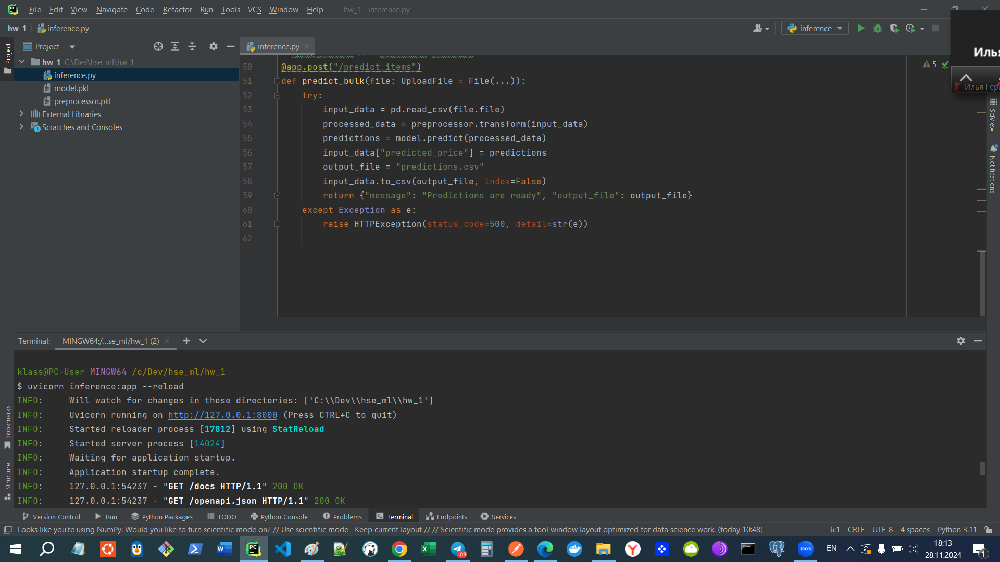
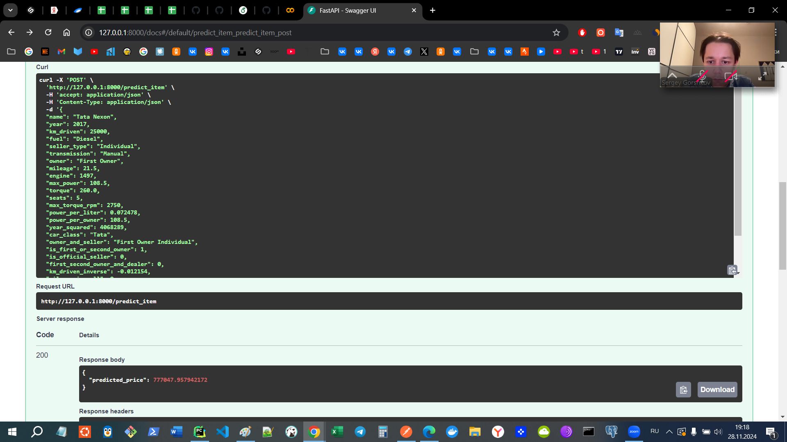
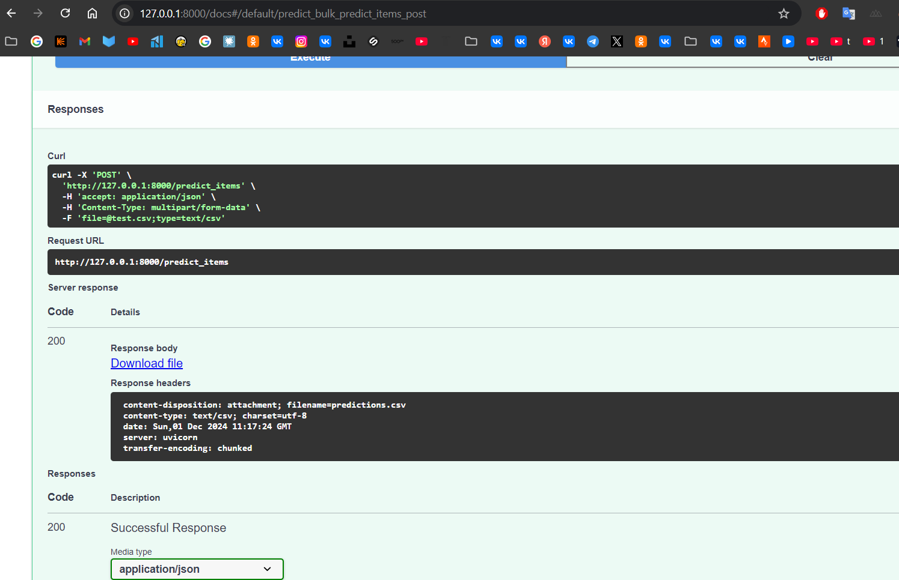

# Выводы по проделанной работе

## Обзор проекта
Проект был направлен на создание модели машинного обучения для предсказания стоимости автомобилей и разработку веб-сервиса на базе FastAPI для предоставления этих предсказаний.

## Что было сделано:
- Подготовлены и проанализированы данные.
- Обучены различные модели машинного обучения.
- Проведена настройка гиперпараметров с использованием GridSearchCV.
- Выбрана лучшая модель на основе метрик качества.
- Разработана архитектура REST API на FastAPI для предоставления сервиса предсказания.
- А также все остальное что было в задании))

## Достигнутые результаты:
- **Модель**: Разработана модель, способная предсказывать стоимость автомобиля с высокой точностью. Лучшие результаты показала полиномиальная регрессия с регуляризацией Ridge.
- **API**: Создан гибкий REST API, который поддерживает два типа запросов:
  - Индивидуальное предсказание: принимает JSON с характеристиками автомобиля и возвращает предсказанную стоимость.
  - Батч-предсказание: принимает CSV файл с характеристиками множества автомобилей и возвращает CSV файл с предсказанными стоимостями.
  
  **Метрики качества модели**:
  - R² на тестовой выборке: 0.9421
  - MSE на тестовой выборке: 33280970522.801212
  - Test Business Metric (<= 10% diff): 41.60%
  - Test Custom Business Metric: 68449.65
  
  Эти показатели свидетельствуют о высокой точности модели.

## Что дало наибольший буст в качестве:
- Использование полиномиальной регрессии с регуляризацией Ridge.
- Тщательная настройка гиперпараметров с помощью GridSearchCV.
- Инженерия признаков, включая преобразование категориальных признаков и создание новых.

## Ограничения и проблемы:
- **Сложность задачи**: Предсказание стоимости автомобилей оказалось сложным из-за множества факторов, влияющих на цену.
- **Качество данных**: Наличие шума в данных и недостаток некоторых характеристик ограничивает точность модели.
- **Новые данные**: Модель может терять точность при появлении новых данных с новыми характеристиками или изменениями в рыночной ситуации.

## Что сделать не вышло и почему:
- Не удалось достичь идеальной точности предсказания из-за временных ограничений.
- Хотя более сложные модели, такие как нейронные сети, могли бы улучшить результат, их использование мы еще не проходили и в тз нельзя было применять.

## Заключение
Проект успешно достиг поставленных целей: разработан сервис на базе FastAPI, обеспечивающий точные предсказания стоимости автомобилей. 

## Скрины работы сервиса

[сам сервис](inference.py)
